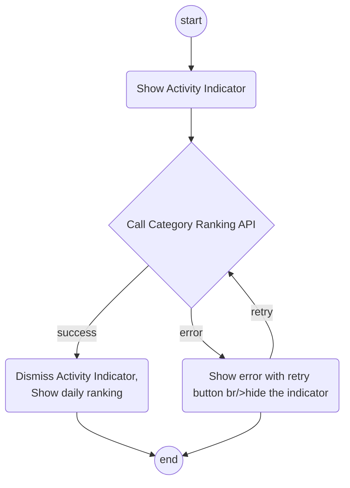
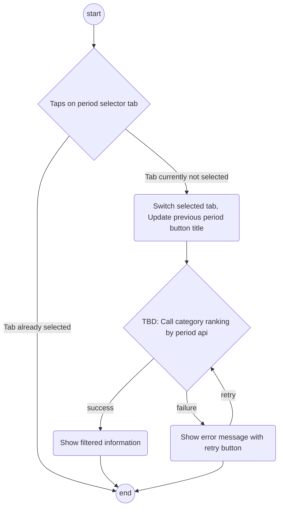
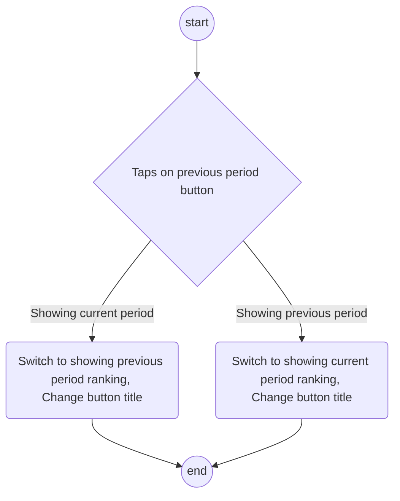
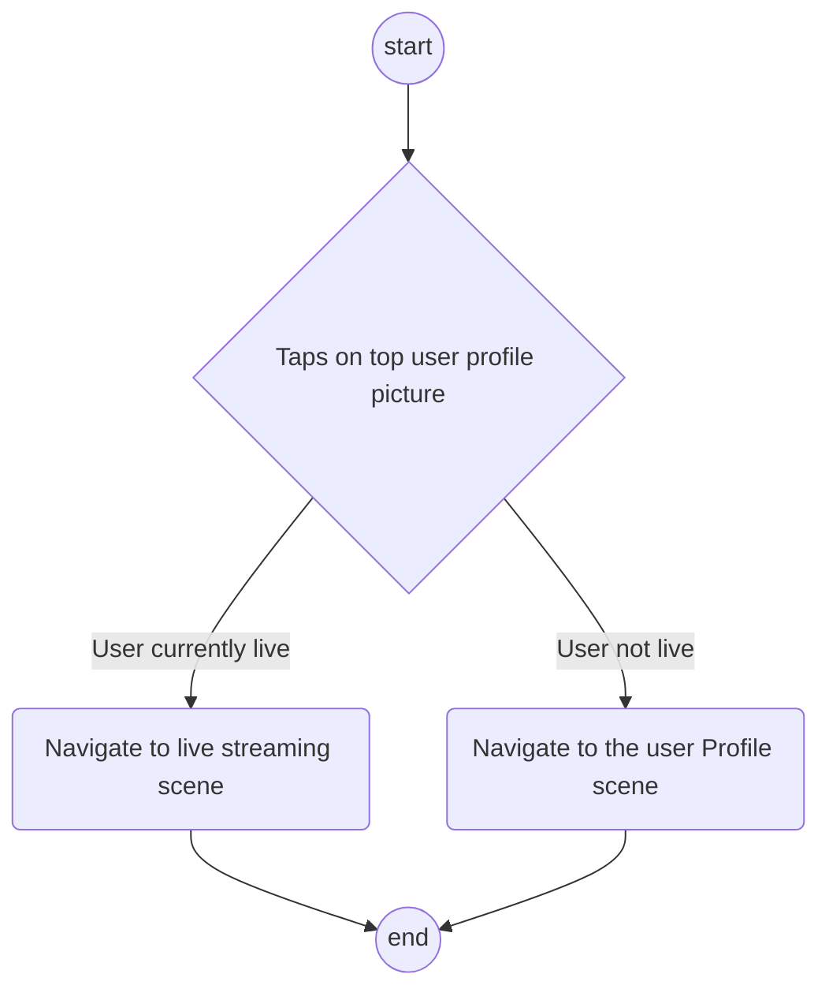
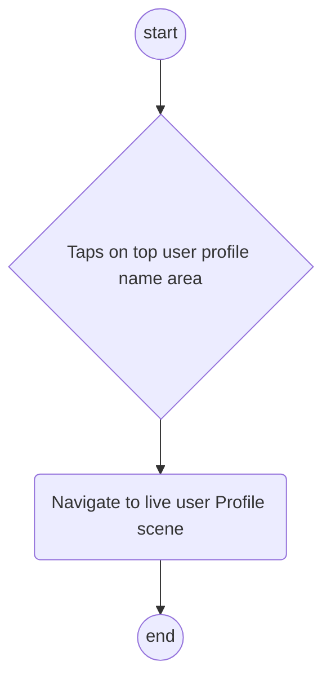
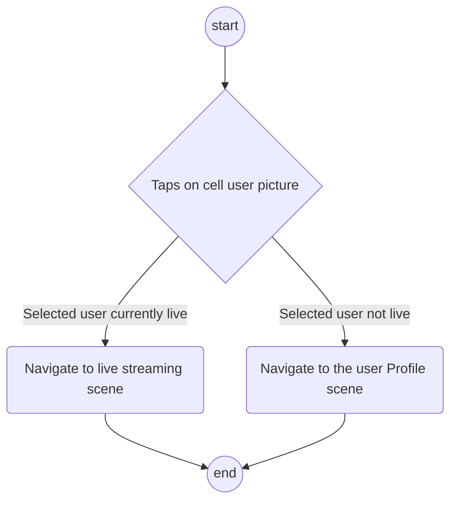
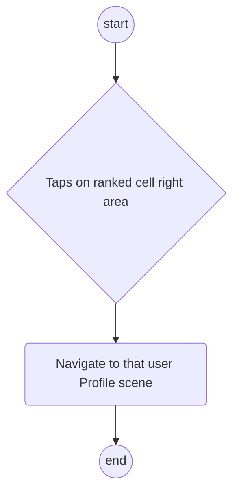
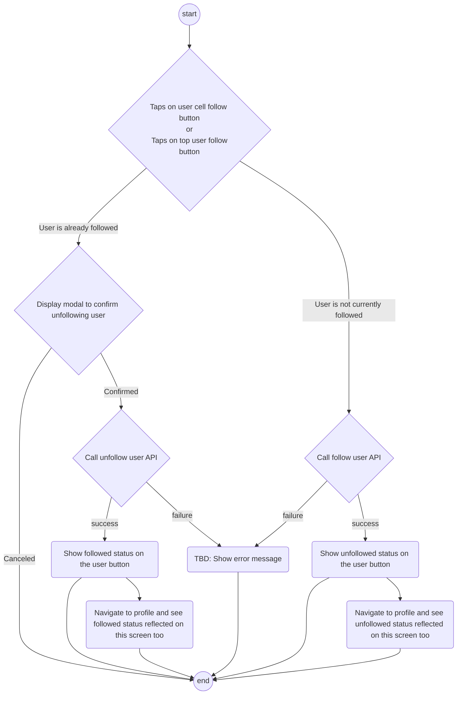

# Login_Test

# User Ranking by Category  
This screen will show the Livers ranking by a particular category

## References

 - [PRD_User Ranking Requirement Document](https://confluence.rakuten-it.com/confluence/display/RLRP/PRD_User+Ranking)
 - [Comprehensive layout](https://www.figma.com/file/MmTubyJGHsgiQIU9XnNRFx/R-Live-UI-Design?node-id=715%3A12)   

## Entry points

### User Ranking
When tapping on the more button of the particular category section in the Liver Ranking in the [User Ranking Scene](UserRanking.md)

## User Interface

|No.|Element|Description|
|---|---|---|
|1|navigationBar||
|1.1|backButton||
|1.2|navigationTitle||
|2|periodCustomTabComponent|Will contain three period tabs daily/weekly/monthly. Daily will be the default option TBD: Custom component?|
|3|previousPeriodButton|Will vary depending on the period tab selected|
|4|topUserAreaView|Top user area, has background image|
|4.1|topUserNameLabel||
|4.2|topUserImageLabel|Has animation when user is streaming|
|4.3|topUserRankedCategoryImageView||
|4.4|topUserRankedCategoryValueLabel||
|4.5|topUserFollowButton|Changes design depending on whether the user has been followed or not|
|5|userTableView||
|6|[RankedUserTableViewCell](RankedUserTableViewCell.md)|Will start from the 2nd user in this ranked category. Display crown image in the position for 2nd and 3rd place|

### Actions
|No.|Event|When|Action|
|---|---|---|---|
|1|Navigation back Button Tapped|-|Pop the view controller|
|2|Period Selector Tab Selected|-|Reload data with the filtered data, switch previousPeriodButton title|
|3|Previous Period Button Tapped|-|Display ranking info for the previous period(Can be previous day, week or month depending on the tab selected)|
|4|Top User Image Tapped|When user is not streaming|Navigate to user Profile|
|4|Top User Image Tapped|When user is streaming|Navigate to the LiveStreaming Scene |
|5|Top User Name Area Tapped|-|Navigate to user Profile|
|6|Top User Follow Button Tapped|-|Call method to unfollow/follow the selected user updating the style of said button, and reflect the new status within other screens where it is shown|
|7|[RankedUserTableViewCell](RankedUserTableViewCell.md) Image Tapped|When user is not streaming|Navigate to user Profile|
|7|[RankedUserTableViewCell](RankedUserTableViewCell.md) Image Tapped|When user is streaming|Navigate to the LiveStreaming Scene |
|8|[RankedUserTableViewCell](RankedUserTableViewCell.md) Right Area Tapped|-|Navigate to user Profile|
|9|[RankedUserTableViewCell](RankedUserTableViewCell.md) Follow Button Tapped|-|Call method to unfollow/follow the selected user updating the style of said button, and reflect the new status within other screens where it is shown|

### Events

### Loads View

### Taps on period selector

### Taps on previous period button

### Taps on top user profile picture

### Taps on top user profile name area

### Taps on ranked cell user picture

### Taps on ranked cell right area (nor picture nor follow button)

### Taps on user cell follow button or top user follow button

